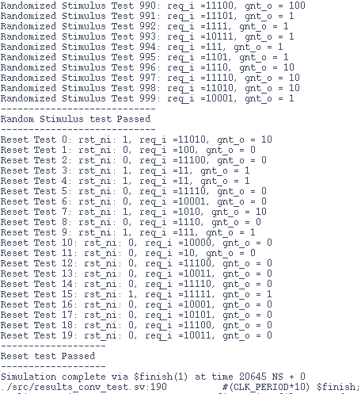
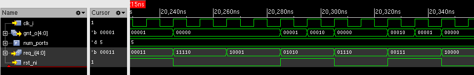
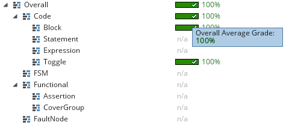

# Parameterized Fixed Priority Arbiter

This repository contains the SystemVerilog RTL code and a self checking testbench for a parameterized Fixed Priority Arbiter

Input:
req_i[num_ports-1:0]: Parameterized request signal
Output:
gnt_o[num_ports-1:0] : Parameterized One hot Encoded Grant Signal

- **Author :** Ujval Madhu
- **Reference :** Rahul Behl, 21 days of RTL, quicksilicon.in
- **Change Log :**  V 2.0, 04 March 2025

## Description
Fixed Priority Arbiters are useful tools extensively used in various digital systems like shared buses, memory controllers, Network On Chips etc, they are advantageous due to their simple and fast implementation.

This is a straight forward implementation of a fixed priority arbiter, it has the following features:
1. Explicit Priority Encoding: the lowest bit of the request signal: req_i[0] has the highest priority, followed by req_i[1] and so on.
2. Static Priority: The priority of each requester remains constant and does not change over time. This is the defining characteristic of a fixed priority arbiter.
3. One Hot Encoded Output: The output gnt_o is a one-hot signal, meaning that only one bit of gnt_o will be high at any given time. This is a standard way to represent a grant signal in arbitration logic.

One of the main issues with a fixed priority arbiter is that there is a potential for starvation, where a low-priority requester might never get access to the resource if higher-priority requesters continuously make requests.

### The Repository has two implementations of the Fixed Priority Arbiter: Synchronous and Asynchronous
the Synchronous design has both clock and reset ports.

### Program Structure:

- results_conv.sv          (Synchronous DUT definition)
- results_conv_test.sv     (Synchronous DUT Test bench)
- async_results_conv.sv    (Asynchronous DUT)
- async_results_conv_test.sv     (Synchronous DUT Test bench)

## Testbench Design

The Asynchronous DUT Testbench is quite simple and performs some manual testcases.

The Synchrnous DUT testbench was designed to provide a comprehensive verification of the DUT. This Includes Functional Coverage, Assertion based Verification, and constrained random stimulus generation. The Testbench achieved 100% code coverage for the DUT.

### 1. Functional Coverage
 A covergroup to track different request patterns (single requests, multiple requests, all requests, no requests) and ensure we're testing all important scenarios is added to the testbench.

- Request Patterns:

	1. Zero requests
	2. Single bit requests (for each port)
	3. Multiple simultaneous requests
	4. All ports requesting

- Grant Patterns:

	1. Zero grants
	2. Grants to each individual port
	3. Illegal multi-grant scenarios (for error checking)

### 2. Assertions

Three SystemVerilog Assertions (SVA) to verify the design:

- Reset Behavior: Ensures all grant outputs are zero when reset is active (Concurrent Assertion)
- One-Hot0 Grant: Verifies at most one grant is active at any time (Immediate Assertion)
- No Request, No Grant: Confirms no grants are issued when there are no requests (Concurrent Assertion)
 

### 3. Test Cases

Various testcases were added to the testbench that tests the following:
- Single bit request testing for each port
- Multiple request combinations to verify priority enforcement
- All requests active (only port 0 should get grant)
- No requests active (no grants should be issued)
- Random request patterns to improve coverage
- Reset verification

Overall this testbench is designed based on a comprehensive metrics driven verification plan that verifies various aspects of the design.

## Tools Used
- Cadence Xcelium
- Cadence IMC

## Output

The Testbench output was obtained as follows:

    

The output waveform of the testbench obtained from xcelium is shown below:

    

The Code coverage report from IMC is shown here:

    

The assertion coverage is shown below:

    

## License

This project is licensed under the GNU General Public License, Version 3 - see the [LICENSE.md](../LICENSE.md) file for details.

## Contact

- Author: Ujval Madhu
- Email: ujvalmadhu003@gmail.com

## Acknowledgments

- This Fixed Priority Adder Design was referenced from Rahul Behl's design from [QuickSilicon](https://quicksilicon.in)
- The Testbenches were designed independently with online resources including IEEE Std 1800.2017 System Verilog LRM