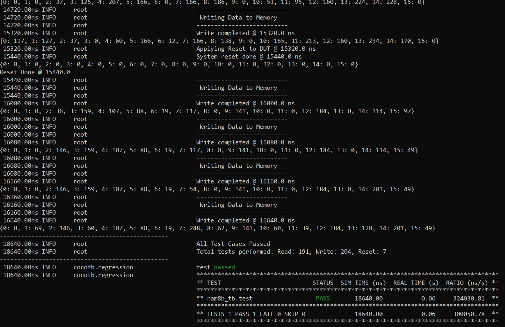
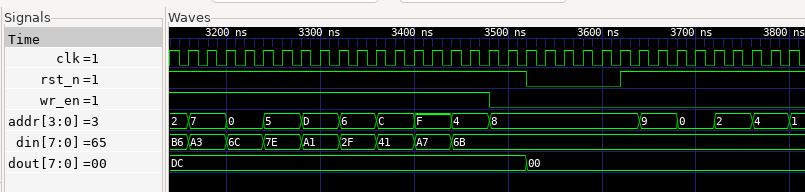

# 16x8 Random Access Memory

The Project aims to design a simple 16x8 RAM (Random Access Memory) and verify it using a cocotb testbench by first devloping a verification plan and addressing it. The test bench has the following capabilities Self Checking, Constrained randomized stimulus, Logging and Reporting, Functional Equivalence.


## Description

- DUT Priority Encoder: 
The module implements a simple 16x8 RAM (Random Access Memory) with synchronous read and write operations. Key features include:

- 16 memory locations (4-bit address space)
- 8-bit data width for storage
- Synchronous operation controlled by a clock signal
- Active-low reset for clearing the memory
- Write enable control signal to determine read vs write operations

The memory behaves as follows:

- On reset: All memory locations are cleared to zero
- On write: When write enable is high, data is stored at the specified address
- On read: When write enable is low, data at the specified address is output

## Testbench: 

The testbench is designed on the basis of a verification pla that provides a comprehensive verification of the memory module, 

#### The verification plan takes into consideration the following cases:

1. Basic Functionality Tests

- Reset Verification: Verify that all memory locations are properly initialized to 0 after reset
- Write Operation: Write data to various addresses and verify it's stored correctly
- Read Operation: Read from previously written addresses and verify correct data is retrieved
- Write-Read Sequence: Perform consecutive write followed by read to the same address
- Read-after-Write: Test reading the same address immediately after writing to it

2. Memory Behavior Testing

- Memory Retention: Verify data remains unchanged when not being written to
- Memory Independence: Verify writing to one address doesn't affect data in other addresses
- Memory Scanning: Write unique patterns to all locations and read them back


Based on these consideration the testbench is created with the following capabilities:

- Automated Clock Generation

Generates a 20ns period clock for synchronous operations


- Randomized Reset Testing

Initial system reset at the beginning of simulation
Probabilistic reset insertion during testing (10% chance per iteration)
Memory model synchronized with DUT during reset


- Constrained Random Stimulus

Randomized choice between read and write operations
Variable number of reads/writes per test iteration
Random addresses and data values for comprehensive coverage


- Reference Model Comparison

Maintains a Python dictionary as a reference model
Automatically updates model during write operations
Verifies DUT output against model during read operations
Error counting and reporting for discrepancies


- Detailed Logging and Reporting

Simulation time stamping for all operations
Hierarchical logging with operation categories
Memory model state visibility during simulation
Error detection and reporting


### Program Structure:


- ram8b.sv    (DUT definition)
- ram8b_tb.py (Python based testbench using cocotb)
- Makefile     (Build automation)


## Build Process:

The Makefile sets up a cocotb simulation environment with these key configurations:

    - Using Icarus Verilog simulator to run SystemVerilog code
    - The RTL source being simulated is "clocks.sv"
    - The top-level module to test is named "top"
    - The Python testbench file is "clocks_tb.py"

The makefile leverages cocotb's built-in simulation framework by including the standard Makefile.sim, which provides all the compilation and simulation targets. You simply run make to execute the tests.

## Running the Simulation

```bash

make sim=icarus      # This compiles all the RTL code and the Python testbench and generates the dump.vcd waveform dump file

gtkwave dump.vcd     # GTWave opens the GUI and reads the generated waveform dump file

```
## Output

The Testbench output was obtained as follows:
<p>
    
</p>


The output waveform of the testbench obtained from GTKWave is as follows:
<p>
    
</p>

## License

This project is licensed under the GNU General Public License, Version 3 - see the [LICENSE.md](../LICENSE.md) file for details.

## Contact

- Author: Ujval Madhu
- Email: ujvalmadhu003@gmail.com

## Acknowledgments

- This Project was done based on references provided from the online documentations of Cocotb and with the help of notes and tutorials from Kumar Khandagle [Kumar's website](https://namaste-fpga.com/#/)