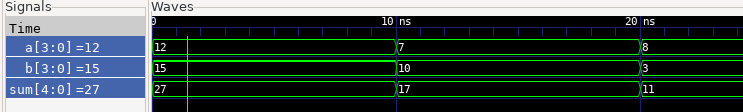

# Adder Project

This Project testbench provides a series of input stimuli to the adder and verifies if the output is correct for each stimulus, ensuring the adder module is functioning as expected for these specific test cases.


## Description

This cocotb testbench add_stimuli tests a digital adder module (DUT). It does this by:

1. Setting input values: It assigns specific values to the inputs a and b of the adder module (dut.a, dut.b).
2. Waiting for propagation: It waits for 10 nanoseconds (Timer(10, units = 'ns')) to allow the adder circuit to calculate and the output sum to stabilize.
3. Verifying the output: It then checks if the output sum of the adder (dut.sum.value) matches the expected sum of the inputs. It uses assert to check for correctness and reports an error message with the current simulation time if the sum is incorrect.
4. Repeating the process: It repeats steps 1-3 with different sets of input values ( a=7, b=10 and a=8, b=3) to test the adder under various conditions.

### Program Structure:


- adder.sv    (DUT definition)
- adder_tb.py (Python based testbench using cocotb)
- Makefile     (Build automation)


## Build Process:

The Makefile sets up a cocotb simulation environment with these key configurations:

    - Using Icarus Verilog simulator to run SystemVerilog code
    - The RTL source being simulated is "clocks.sv"
    - The top-level module to test is named "top"
    - The Python testbench file is "clocks_tb.py"

The makefile leverages cocotb's built-in simulation framework by including the standard Makefile.sim, which provides all the compilation and simulation targets. You simply run make to execute the tests.

## Running the Simulation

```bash

make sim=icarus      # This compiles all the RTL code and the Python testbench and generates the dump.vcd waveform dump file

gtkwave dump.vcd     # GTWave opens the GUI and reads the generated waveform dump file

```
## Output Waveform

The output waveform obtained from GTKWave is as follows:
<p>
    
</p>


## License

This project is licensed under the GNU General Public License, Version 3 - see the [LICENSE.md](../LICENSE.md) file for details.

## Contact

- Author: Ujval Madhu
- Email: ujvalmadhu003@gmail.com

## Acknowledgments

- This Project was done based on references provided from the online documentations of Cocotb and with the help of notes and tutorials from Kumar Khandagle [Kumar's website](https://namaste-fpga.com/#/)