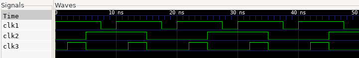

# Clock Gen Project

The Project aims at stimulating a dut with three distinct clock signals, each with different characteristics, for a duration of 200 ns. 


## Description

The cocotb test bench creates three different clock signals (clk1, clk2, clk3) and applies them to a digital design (represented by dut).

clk1(dut): Generates a clock signal named clk1 with a fixed on-time (ton) of 7.5 ns and off-time (toff) of 2.5 ns. This creates a periodic clock with a non-50% duty cycle.

clk2(dut): Generates a clock signal named clk2 with a fixed on-time (ton) and off-time (toff) of 10 ns each, resulting in a 50% duty cycle.  It also introduces a phase shift of 5 ns at the beginning, meaning clk2 will remain low for 5ns before starting to toggle.

clk3(dut): Generates a clock signal named clk3 based on frequency (100 MHz) and duty cycle (30%). It calculates the necessary ton and toff values to achieve these specifications. It also includes a phase shift of 2 ns. The parameters and calculated ton and toff values are logged for information.

test(dut): This is the main test function. It starts all three clock generation functions concurrently using cocotb.start_soon, making them run in parallel. Finally, it waits for 200 ns using Timer before the test completes.


### Program Structure:


- clocks.sv    (DUT definition)
- clocks_tb.py (Python based testbench using cocotb)
- Makefile     (Build automation)


## Build Process:

The Makefile sets up a cocotb simulation environment with these key configurations:

    - Using Icarus Verilog simulator to run SystemVerilog code
    - The RTL source being simulated is "clocks.sv"
    - The top-level module to test is named "top"
    - The Python testbench file is "clocks_tb.py"

The makefile leverages cocotb's built-in simulation framework by including the standard Makefile.sim, which provides all the compilation and simulation targets. You simply run make to execute the tests.

## Running the Simulation

```bash

make sim=icarus      # This compiles all the RTL code and the Python testbench and generates the dump.vcd waveform dump file

gtkwave dump.vcd     # GTWave opens the GUI and reads the generated waveform dump file

```
## Output Waveform

The output waveform obtained from GTKWave is as follows:
<p>
    
</p>

## License

This project is licensed under the GNU General Public License, Version 3 - see the [LICENSE.md](../LICENSE.md) file for details.

## Contact

- Author: Ujval Madhu
- Email: ujvalmadhu003@gmail.com

## Acknowledgments

- This Project was done based on references provided from the online documentations of Cocotb and with the help of notes and tutorials from Kumar Khandagle [Kumar's website](https://namaste-fpga.com/#/)