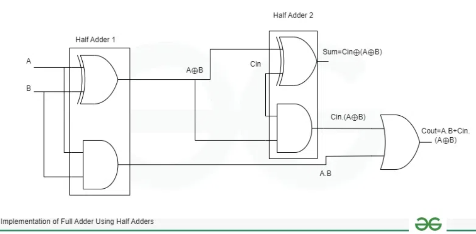

# 4-Bit Ripple Carry Adder Project

The Project aims to design a 4-Bit Ripple Carry Adder and verify it using using randomized cocotb testbench that performs 30 test cycles, driving random inputs to the 4-bit adder DUT, and verifying if the outputs are correct based on the expected behavior.


## Description

- DUT 4-Bit Ripple Carry Adder: 
A 4-bit ripple carry adder is a digital circuit designed to add two 4-bit binary numbers. It's built in a cascading fashion using four full adder blocks. Each full adder is responsible for adding two bits at a specific position, along with a carry-in from the previous less significant position, and producing a sum bit and a carry-out to the next more significant position.

Ripple Carry Addeer Block diagram is shown here:
<p>
    
</p>

Within each full adder, the logic is further decomposed. A full adder itself is commonly implemented using two half adder circuits and an OR gate.

- Half Adder: A half adder takes two single-bit inputs (let's say A and B) and produces two outputs: a Sum (A XOR B) and a Carry (A AND B). It's for adding two bits without considering a carry-in.

- Full Adder: A full adder improves upon the half adder by including a Carry-In input. It takes three inputs: two bits to be added (A and B) and a Carry-In (Cin) from the previous stage. It produces two outputs: a Sum bit and a Carry-Out (Cout) to the next stage.  Internally, it can be constructed by using two half adders.  The first half adder adds A and B to produce a partial sum and a first carry. The second half adder then adds this partial sum with the Carry-In (Cin) to produce the final Sum bit. The Carry outputs from both half adders are then ORed together to produce the final Carry-Out (Cout).

The Block diagram of a full adder built using 2 half adders is shown here:
<p>
    
</p>

- Testbench: 
The testbench aims to randomly stimulate the DUT's inputs (a, b, cin) with 30 different test cases and check if the DUT's outputs (sum, cout) match the expected results.

#### Key Operations:

- Initialization:

Sets an error_count to 0 to track test failures.
Configures the Python logger to display informational messages.
Test Loop (30 Iterations):

- Random Input Generation: 
In each iteration, it generates random integer values for inputs a and b (ranging from 0 to 15) and cin (0 or 1).

- DUT Input Assignment: 
Assigns these random values to the corresponding input signals of the DUT (dut.a, dut.b, dut.cin).
Delay: Waits for 10 nanoseconds (Timer(10, 'ns')) to allow the DUT to process the inputs and produce outputs.

- Output Reading: 
Reads the integer values from the DUT's output signals sum and cout.
Expected Output Calculation: Calculates the expected sum based on the randomized inputs and the cout value. It assumes a 4-bit adder, adding 16 to sout if cout is asserted (indicating a carry-out).

- Error Checking: 
Compares the calculated exp_sum with the sum read from the DUT. If they don't match, it increments the error_count and prints an error message with the simulation time.
Value Printing (Debugging/Monitoring): Prints the input and output values of the DUT for each iteration, along with the calculated expected sum, which helps in monitoring the test progress and debugging.
Another Delay: Waits for another 10 nanoseconds before the next iteration.

- Result Reporting
Checks the error_count. If error_count is greater than 0, it logs an error message indicating the number of errors found. Otherwise, it logs an informational message stating "All Test Cases Passed".

### Program Structure:


- mux8x1.sv    (DUT definition)
- mux8x1_tb.py (Python based testbench using cocotb)
- Makefile     (Build automation)


## Build Process:

The Makefile sets up a cocotb simulation environment with these key configurations:

    - Using Icarus Verilog simulator to run SystemVerilog code
    - The RTL source being simulated is "clocks.sv"
    - The top-level module to test is named "top"
    - The Python testbench file is "clocks_tb.py"

The makefile leverages cocotb's built-in simulation framework by including the standard Makefile.sim, which provides all the compilation and simulation targets. You simply run make to execute the tests.

## Running the Simulation

```bash

make sim=icarus      # This compiles all the RTL code and the Python testbench and generates the dump.vcd waveform dump file

gtkwave dump.vcd     # GTWave opens the GUI and reads the generated waveform dump file

```
## Output
The Testbench output is shown here:
<p>
    
</p>

The output waveform obtained from GTKWave is as follows:
<p>
    
</p>

## License

This project is licensed under the GNU General Public License, Version 3 - see the [LICENSE.md](../LICENSE.md) file for details.

## Contact

- Author: Ujval Madhu
- Email: ujvalmadhu003@gmail.com

## Acknowledgments

- This Project was done based on references provided from the online documentations of Cocotb and with the help of notes and tutorials from Kumar Khandagle [Kumar's website](https://namaste-fpga.com/#/)