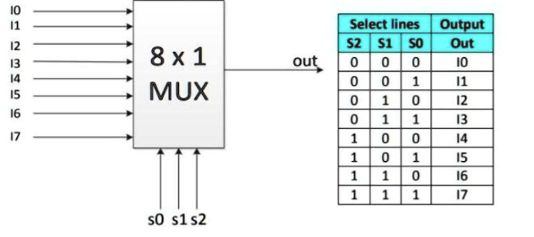
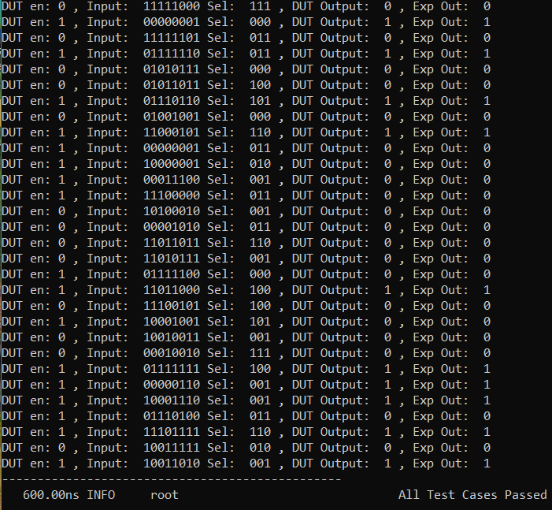
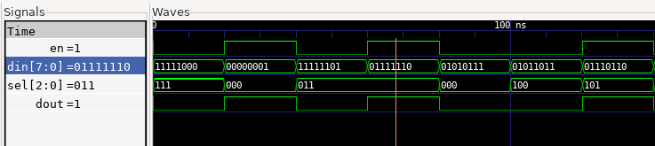

# 8x1 Mux Project

The Project aims to design a Standard 8x1 MUX and verify it using a cocotb testbench with randomized stimulus


## Description

- DUT 8x1 MUX: 
An 8x1 multiplexer (mux) is a digital logic circuit that selects one of eight input signals and routes it to a single output signal. The selection is controlled by three select lines.  Based on the binary combination of the select lines (from 000 to 111), one of the eight inputs is chosen and passed through to the output, effectively acting as a data selector or switch.

A Standard 8x1 MUX Block diagram and Truth table is shown here:
<p>
    
</p>

- Testbench: 
This testbench evaluates the dut by running 30 randomized test cases that compare hardware outputs to a reference output.
For each test, it:

1. Generates a random 8-bit input, a random 3-bit select and random enable signal
2. Applies these to both the DUT
3. Waits 10ns for the hardware to respond
4. Compares the actual output with the expected output
5. Logs any discrepancies with timestamps
6. Reports a final pass/fail summary with error count


### Program Structure:


- mux8x1.sv    (DUT definition)
- mux8x1_tb.py (Python based testbench using cocotb)
- Makefile     (Build automation)


## Build Process:

The Makefile sets up a cocotb simulation environment with these key configurations:

    - Using Icarus Verilog simulator to run SystemVerilog code
    - The RTL source being simulated is "clocks.sv"
    - The top-level module to test is named "top"
    - The Python testbench file is "clocks_tb.py"

The makefile leverages cocotb's built-in simulation framework by including the standard Makefile.sim, which provides all the compilation and simulation targets. You simply run make to execute the tests.

## Running the Simulation

```bash

make sim=icarus      # This compiles all the RTL code and the Python testbench and generates the dump.vcd waveform dump file

gtkwave dump.vcd     # GTWave opens the GUI and reads the generated waveform dump file

```
## Output
The Testbench output is shown here:
<p>
    
</p>

The output waveform obtained from GTKWave is as follows:
<p>
    
</p>

## License

This project is licensed under the GNU General Public License, Version 3 - see the [LICENSE.md](../LICENSE.md) file for details.

## Contact

- Author: Ujval Madhu
- Email: ujvalmadhu003@gmail.com

## Acknowledgments

- This Project was done based on references provided from the online documentations of Cocotb and with the help of notes and tutorials from Kumar Khandagle [Kumar's website](https://namaste-fpga.com/#/)