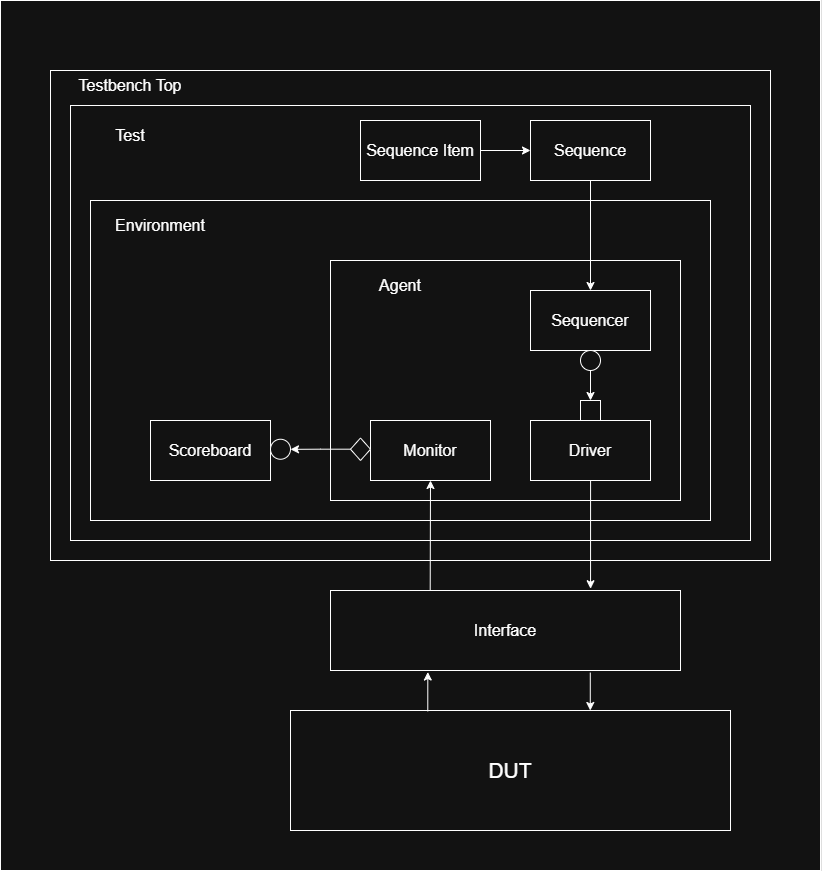
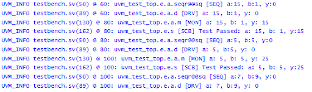
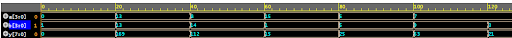

# Simple UVM testbench for a Multiplier

This repository holds the code for a simple testbench designed using UVM for a 4-bit multiplier module.

- **Author :** Ujval Madhu
- **Reference :** Kumar Khandagle, [Namaste FPGA](https://namaste-fpga.com/#/)
- **Change Log :**  V 2.0, 09 April 2025

## Description

This is a very simple UVM testbench that is used to verify a multiplier. The testbench architecture and code structure is given below.

The Testbench architecture is as follows:

    

### Program Structure:

- mul.v             : DUT
- mul_if.v          : Interface
- tb_top.sv         : Testbench top module
- test.sv           : Test Class
- env.sv            : Environment class
- agt.sv            : Agent Class
- scb.sv            : Scoreboard Class
- mon.sv            : Monitor Class
- drv.sv            : Driver Class
- seq.sv            : Sequence Class
- tr_item.sv        : Sequence/Transaction item Class

## Tools Used
- Cadence Xcelium
- edaplayground.com

## Output

The Testbench output was obtained as follows:

    

The output waveform of the testbench obtained from xcelium is shown below:

    

## License

This project is licensed under the GNU General Public License, Version 3 - see the [LICENSE.md](../LICENSE.md) file for details.

## Contact

- Author: Ujval Madhu
- Email: ujvalmadhu003@gmail.com

## Acknowledgments

- Verification Series,UVM Projects, Kumar Khandagle [Namaste FPGA](https://namaste-fpga.com/#/)
- Universal Verification Methodology 1.2 User's Guide, Accellera Systems Initiative